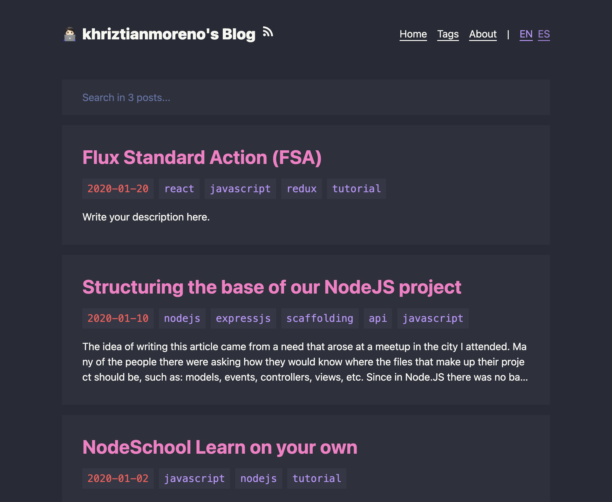

# Khriztianmoreno's Blog (Astro Dracula Blog)

A fast and simple blog system built with [Astro](https://astro.build/), inspired by [Dracula](https://draculatheme.com/).



## :fire: Features

- [x] :rocket: Fast & High Performance
- [x] :star: Simple & Clean Design
- [x] :iphone: Responsive Design
- [x] :vampire_man: Dracula Theme
- [x] :zap: Animations created with [Motion](https://motion.dev) (the original Framer Motion)
- [x] :mag: Fuzzy Search built with [fuse.js](https://www.fusejs.io/)
- [x] :world_map: Sitemap & RSS Feed
- [x] :spider_web: SEO-Friendly
- [x] :earth_asia: I18n-Supported (`es` & `en`)
- [x] :triangular_ruler: Mathjax
- [x] :octocat: [GitHub Alerts](https://github.com/chrisweb/rehype-github-alerts)
- [x] :book: TOC (Table of Contents)

## :white_check_mark: Lighthouse Score

<p aligh="center">
    <a href="https://pagespeed.web.dev/analysis/https-blocklune-cc/72o0c25cxa?form_factor=desktop">
        
    </a>
</p>

## :rocket: How To Use

File structure:

```text
.
├── astro.config.mjs
├── package.json
├── public/
├── src/
│   ├── assets/
│   │   └── avatar.webp
│   ├── components/
│   ├── config.ts
│   ├── content/
│   │   ├── config.ts
│   │   ├── drafts/
│   │   │   └── ...
│   │   ├── info/
│   │   │   ├── en/
│   │   │   │   └── about.md
│   │   │   └── es/
│   │   │       └── about.md
│   │   └── posts/
│   │       ├── en/
│   │       │   └── example-post.md
│   │       └── es/
│   │           └── example-post.md
│   ├── middleware.ts
│   ├── pages/
│   ├── schemas/
│   ├── styles/
│   └── utils/
├── tailwind.config.mjs
└── tsconfig.json
```

To use this theme, follow these steps:

1. Edit `src/config.ts` to configure the basic information for your site. You can also configure your [umami](https://umami.is/) analytics and search engine verifications here.
2. Replace `src/assets/avatar.webp` with your own avatar.
3. Rewrite your own about page text in `src/content/info/en/about.md` & `src/info/es/about.md`.
4. Delete my posts in `src/content/posts` and write your own. Currently the theme supports both Chinese and English languages, for different language versions of the same post, you need to make sure they are located in the `en` and `es` directories and use the same filename.

To start writing a new post, you can use the `pnpm new` command (see below), or follow these steps:

1. Create a file in `src/content/posts/en` if you are writing the English version of a post, say `hello-world.md`.
2. Edit the file `src/content/posts/en/hello-world.md` like this:

```text
---
title: Hello World
tags:
- hello
- my-first-post
date: 2024-11-12 18:50:00
---

Hello! This is my first post!

<!--more-->

I'm writing my first post!
```

To customize the color scheme of this theme, edit the following files:

- `src/components/prose.astro`
- `src/styles/global.css`
- `src/styles/rehype-github-alerts.css`
- `tailwind.config.mjs`

Currently this theme supports both Chinese and English, and uses English as its default language. To switch it to Chinese, edit `src/utils/i18n.ts`:

```ts
export const defaultLang: Lang = "en";
```

Useful commands:

```bash
# install dependencies
pnpm install

# start the dev server
pnpm dev

# build the project
pnpm build

# preview (after the build)
pnpm preview

# create a new post (or draft)
pnpm new
```

More detailed usage of `pnpm new` (The output of `pnpm new --help`):

```text
Usage: pnpm new [options] <post-title>

Options:
  -l, --lang <en|es>   Set the language (default: en)
  -d, --draft          Create a draft post (default: false)
  -m, --mdx            Use MDX format (default: false)
  -h, --help           Show this help message

Example:
  pnpm new "Hello World"
  pnpm new -l es "Hola Mundo"
```
